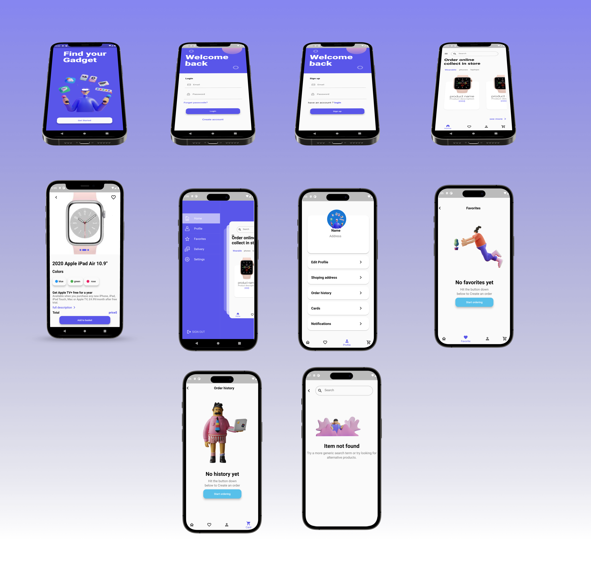
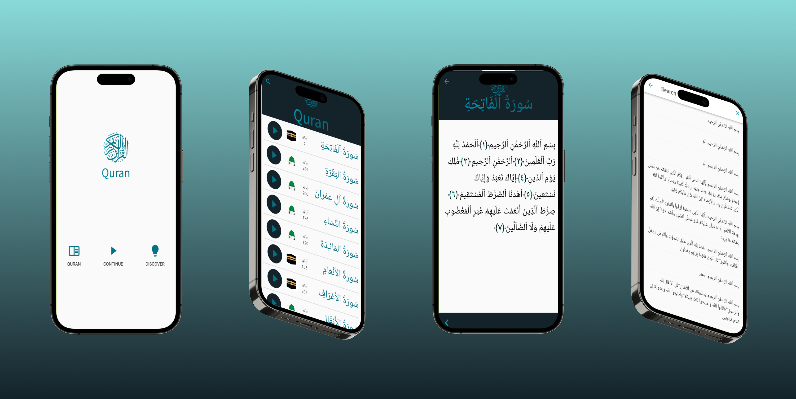
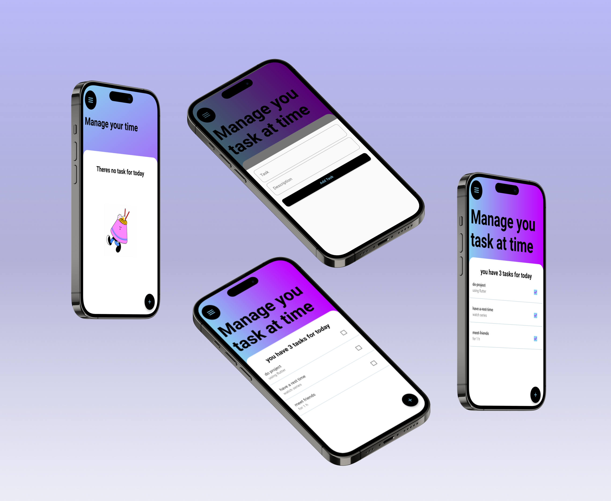

<h1 align="center">Hi there, I'm Deema 👋</h1>
<h3 align="center">Flutter Developer & Data Analyst</h3>

  <a href="https://deematalat.github.io/deematalat/">🌐 Visit My Website</a> •
  <a href="mailto:deematalat3@gmail.com">📫 Email Me</a> •
  <a href="https://www.linkedin.com/in/deematalat/">💼 LinkedIn</a> •
  <a href="https://twitter.com/deema_talat">🐦 Twitter</a> •
  <a href="https://www.instagram.com/deema_talat/">📸 Instagram</a>

---

## 👩‍💻 About Me

I'm **Deema Talat**, a software engineer passionate about building Flutter applications
and turning data into meaningful insights through analysis and visualization.

- 🔭 Currently working on a **Flutter app for managing personal finances**
- 🌱 Currently learning **Riverpod state management** & **advanced Power BI dashboards**
- 💬 Ask me about **Flutter, Dart, Data Analysis, or Power BI**
- 😄 Pronouns: **she/her**

---

## 🛠️ Skills

### 📱 Mobile Development
✅ Flutter app development  
✅ Dart programming  
✅ API integration  
✅ Firebase  
✅ Google Maps integration  
✅ Animations & UI/UX design  
✅ Version control (Git)  

### 📊 Data Analysis
✅ Power BI (dashboards & reports)  
✅ Data visualization  
✅ Excel & data cleaning  
✅ SQL  
✅ Python for data analysis  

---

## 🧰 Languages & Tools

  
  
  
  
  
  
  
  
  <!-- Power BI doesn't have a devicon, using official MS icon -->
  

---

## 📊 GitHub Stats

  
   
  

---

## 📱 Flutter Projects

  
  
  
  
  

---

Thanks for visiting! Working with you will be an absolute pleasure 🤝

